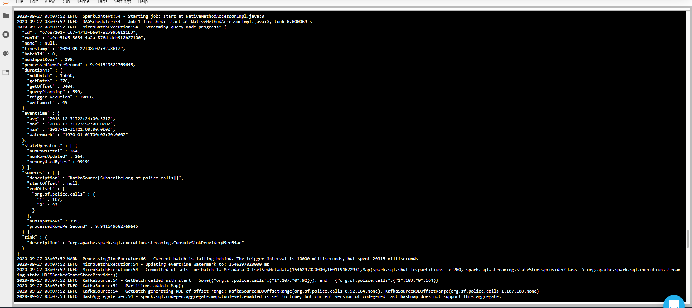
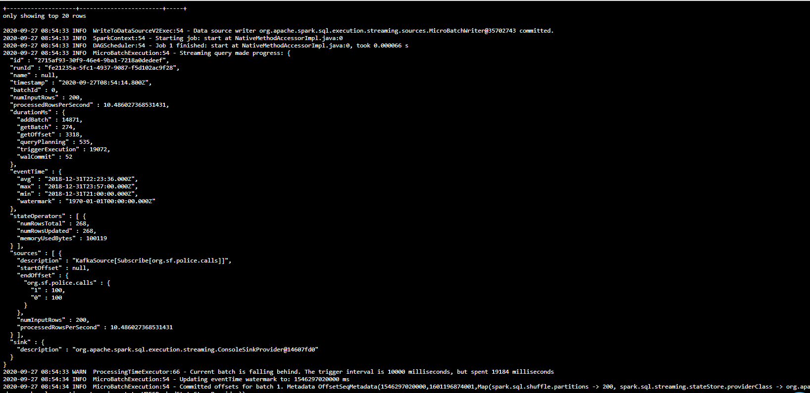
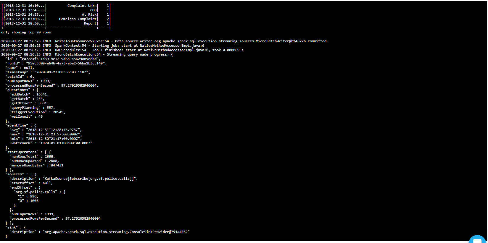
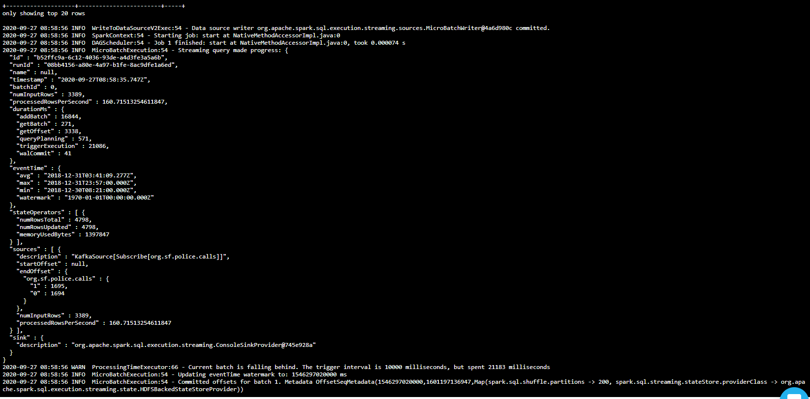
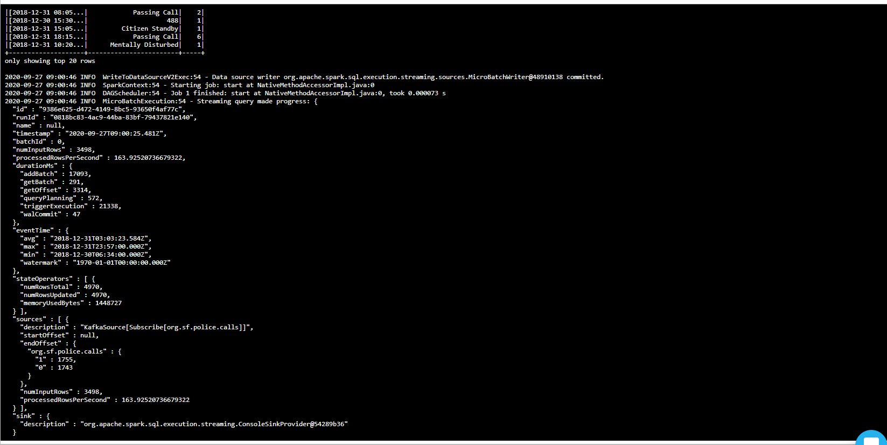

# Udacity Spark Streaming Project (SF-crime-statistics) Step3

* Q: How did changing values on the SparkSession property parameters affect the throughput and latency of the data?

    A: There are two main parameters which affect the throughput and latency of the data:

      - maxOffsetsPerTrigger: Rate limit on maximum number of offsets processed per trigger interval. The specified total number of offsets will be proportionally split across topicPartitions of different volume. The higher this paramerter is, the higher the throughput of the data.

      - maxRatePerPartition: the maximum rate (in messages per second) at which each Kafka partition will be read by this direct API. The higher the paramter is, the lower the latency of the data.

* Q: What were the 2-3 most efficient SparkSession property key/value pairs? Through testing multiple variations on values, how can you tell these were the most optimal?
  
    A: To see the performance of tuning the parameters, I compared processedRowsPerSecond in the progress resport for batch 0 using the original paramter pair as benchmark:
        - maxOffsetsPerTrigger:200 maxRatePerPartition: 100

    After changing the maxRatePerPartition from 100 to 1000, the processedRowsPerSecond for batch 0 increased from 9.9 to 10.5
        - maxOffsetsPerTrigger:200 maxRatePerPartition: 1000

    Based on that, after changing the maxOffsetsPerTrigger from 200 to 2000, the processedRowsPerSecond for batch 0 increased from 10.5 to 97.3. The affect is much more obvious than changing the maxRatePerPartition.
        - maxOffsetsPerTrigger:200 maxRatePerPartition: 1000

    However, those two parameters cannot be increased infinitely. Comparing the key value pair {maxOffsetsPerTrigger:20000 maxRatePerPartition: 10000}with {maxOffsetsPerTrigger:200000 maxRatePerPartition: 100000}, no obvious change can be observed.
        - maxOffsetsPerTrigger:20000 maxRatePerPartition: 10000
        - maxOffsetsPerTrigger:200000 maxRatePerPartition: 100000

    Finally, I got the best performance using paramter: 
        - maxOffsetsPerTrigger:20000 maxRatePerPartition: 10000
